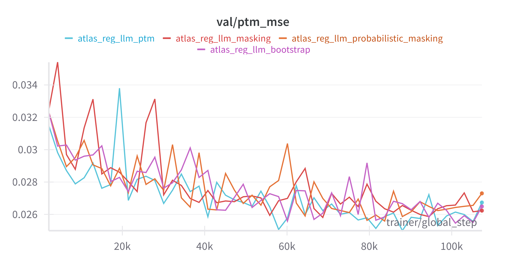
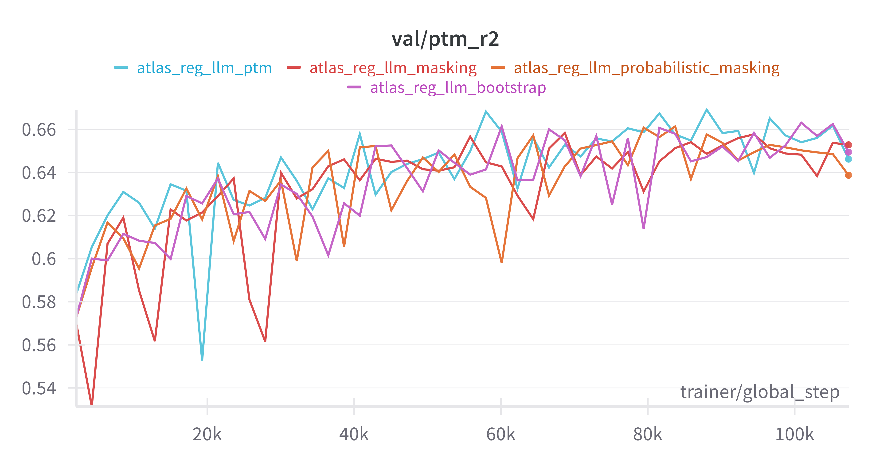
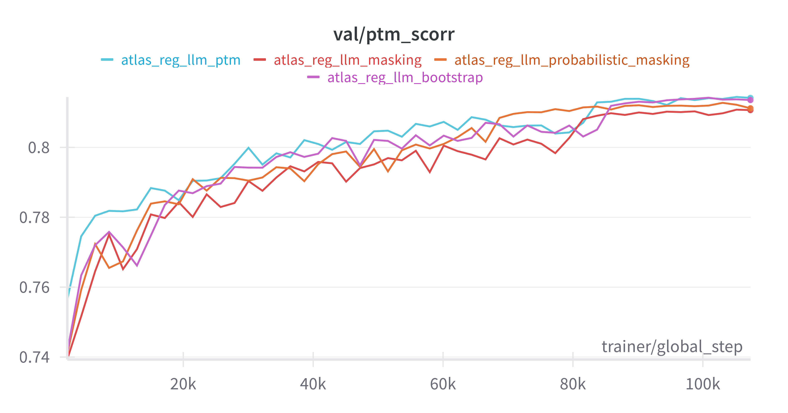

# RL for Protein Sequence Design 

We devolop a protein sequence algorithm using a light-weight proxy model for faster sampling using RL and MCMC.

## Environment setup

```sh
pip install -r requirements.txt
pip install -e dockq-proxy
pip install -e esm/examples/protein-programming-language
```

## Train the Proxy Protein Language Model

```sh
cd dockq-proxy
# The ATLAS pTM based model
python src/train.py trainer=gpu experiment=atlas_reg_llm_ptm

# The ATLAS pLDDT based model
python src/train.py trainer=gpu experiment=atlas_reg_llm_plddt

# The ATLAS pTM based active learning model
python src/train.py trainer=gpu experiment=atlas_reg_llm_ptm_acquisition
```

## Run MCMC Baseline

```sh
python run_mcmc.py
```


## Run RL (DynaPPO) with Proxy

```sh
python run_rl.py +experiment=dynappo program.sequence_length=30
```


## Proxy Model based on ATLAS pTM

### Validation MSE 



### Validation R2 



### Validation Correlation


